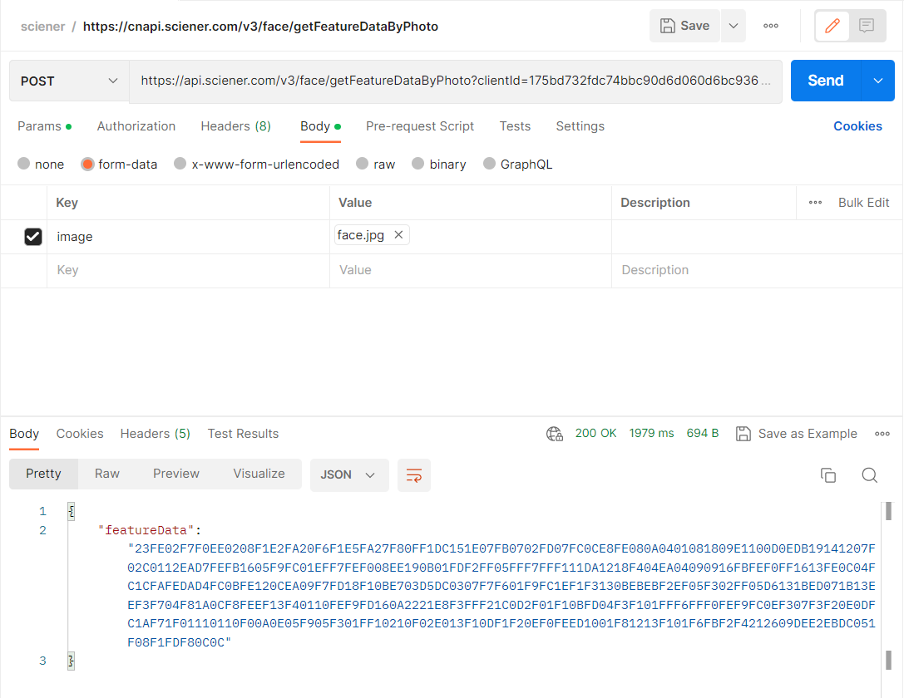

<!-- Source: https://euopen.ttlock.com/document/doc?urlName=cloud%2Fface%2FgetFeatureDataEn.html -->

# Get feature data by photo

**`https://api.sciener.com/v3/face/getFeatureDataByPhoto`**

Upload face photo via this API to get face feature data

**Note:**

**1.Only locks that**

- **support [feature value](https://euopen.ttlock.com/document/doc?urlName=cloud%2Flock%2FfeatureValueEn.html) bit 69 and equipped with corresponding module can use this API get face feature data**
- **or support [feature value](https://euopen.ttlock.com/document/doc?urlName=cloud%2Flock%2FfeatureValueEn.html) bit 110 and equipped with corresponding module can use this API get face feature data**

**2.The frontend also has file format and size restrictions for facial photos. Large files must be compressed by the frontend.**

**Basic Photo Requirements:**

- **Size: 300KB-2MB, Format: Color photo (jpg, png, bmp)**
- **One and only one complete face, with a correct angle, natural expression, clear facial features, and no obstructions**
- **No cluttered background, even lighting, and no reflections**

### 1 Request example

`POST, ContentType:multipart/form-data`

```
https://api.sciener.com/v3/face/getFeatureDataByPhoto?clientId=175bd732fdc74bbc90d6d060d6bc936c&accessToken=7578c1827d42d7be22195d44d30b3f96&lockId=258369&date=1680505019303
```

Image files are placed on the body and uploaded as form-data



### 2 Request parameters

| Name | Type | Required | Description |
| --- | --- | --- | --- |
| clientId | String | Y | client\_id from [Create application](https://euopen.ttlock.com/CreateApplication) |
| accessToken | String | Y | Access token，refer to: [Get access token](https://euopen.ttlock.com/document/doc?urlName=cloud/oauth2/getAccessTokenEn.html) |
| lockId | Int | Y | Lock ID, generated by [Lock init](https://euopen.ttlock.com/document/doc?urlName=cloud/lock/initializeEn.html) |
| image | File/Image | Y | Face photo, size limit: 300KB～2MB, format: jpg、png、bmp |
| date | Long | Y | Current time (timestamp in millisecond) |

### 3 Response and example

| Parameter | Type | Description |
| --- | --- | --- |
| featureData | String | Human face feature data, Hexadecimal string |

```
{
    "featureData": "F0E41DEAEDF7F31420D5F6FD0403ECF0F4EEF7E6010BF3E5EDEDE5E6F4ED1006FBEDFF02DFF4F3EB09DEF408D6FEE7061616FFFF0008FCE807F6040DF01116FAFFF112DEF9180600FE00F5F41126FCE70CE0071401F715F9FDDF0EEBFB1CFA0BF112FF0E040619010FFCC6DCFBFFD0FFF5EAF600FEF4081E15FF03ECEF1705FC05E0120AEDFCF304ED16F2DF0610FDF4060FFBE1E70CF0FD10EA04EEEB080E0E1117F5F3EF05010D0E02FB0EEBF70F01101507F6F20CFBFBF8162836010BFAFD0603E7F519EFFEF4D514EAFF0107DFEF05F519FC0A08FC11FEFEF3FC0E00FCFB0602F0F20809F6020EF00E0EFD01F2FEF70723E100F10AFFF6D7EBF5FBF7ECF7"
}
```
